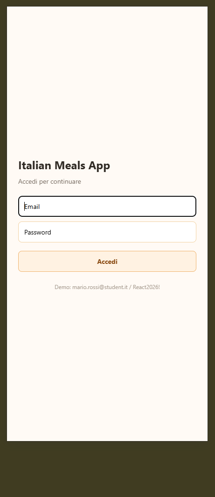
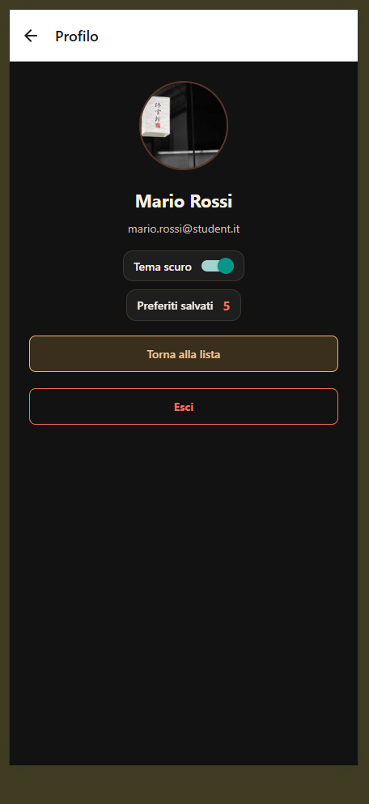
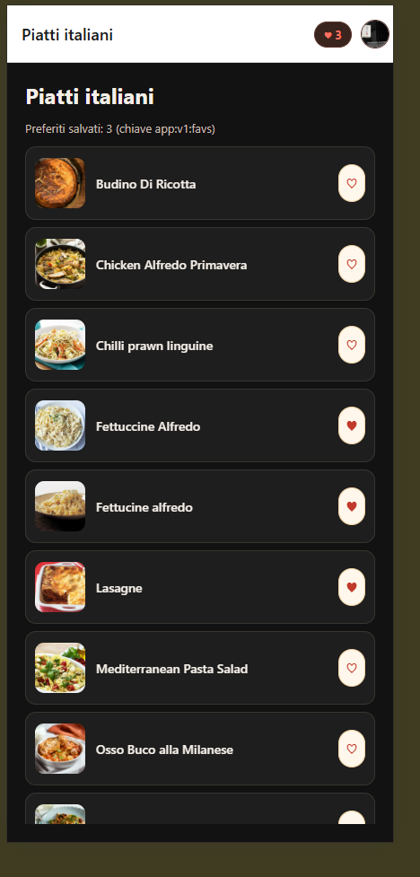
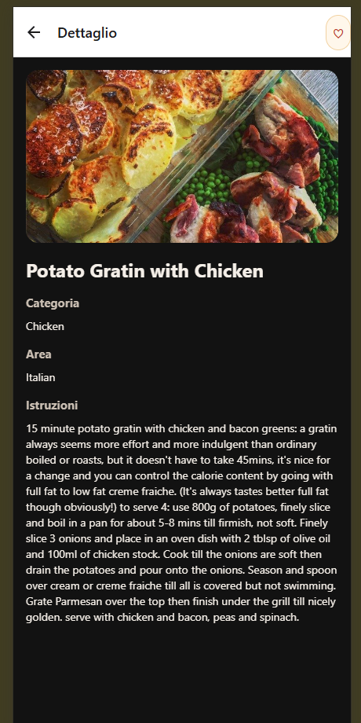
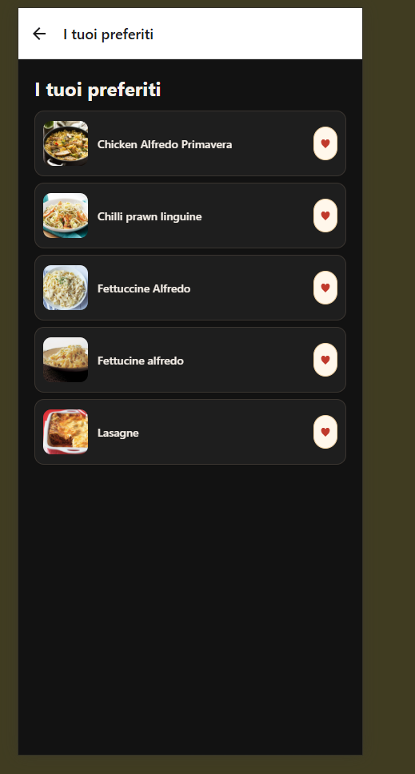

# Progress - Italian Meals App

**Studente:** Robert Mihai Alexandru 
**Repo:** https://github.com/RobertAlexandru67/ItalianMealsApp  
**Ultimo aggiornamento:** 2026-07-09

## Schermate implementate

| Schermata      | Stato   | Screenshot                                          |
| -------------- | ------- | --------------------------------------------------- |
| Login          | ✅      |            |
| Header profilo | ✅      |        |
| Lista piatti   | ✅      |             |
| Ricerca        | ✅      |         |
| Dettaglio      | ✅      |       |
| Preferiti      | ✅      |    |
| Impostazioni   | ✅      |  |
| Errore + Retry | ✅      |           |
| Deep link      | ✅      |     |

## Google Doc (lab 13–22)

**Link:** https://docs.google.com/document/d/1RXdJJVh4GlMYAngYksM9MLcUvdgkYoO3lizdgMCK36Y/edit?tab=t.7y9ka3y2lxel

Uno screenshot per lab **13–22** (come avete fatto per i lab **01–11** alla verifica intermedia).

## Note

- Cosa manca per la consegna finale:
- Scelta stato globale:

## Utenti mock (login di test)

| Email                     | Password    |
| ------------------------- | ----------- |
| mario.rossi@student.it    | React2026!  |